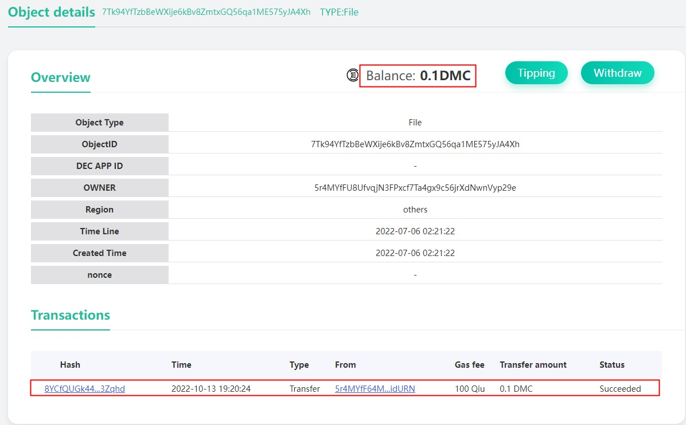
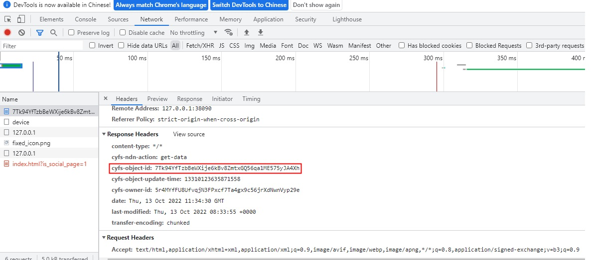
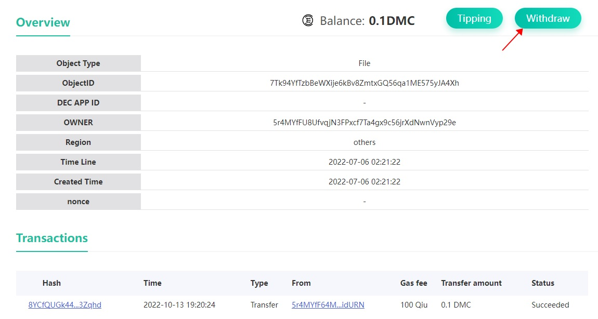

# Give content a little tips: understanding data property rights
With the above example, I believe you have quickly understood the basic features of CYFS Object Link: it gives anyone equal rights to save data and publish content on the Internet, and it is verifiable, so you can build a network of trusted data based on Object Link. Here we will show another important feature of CYFS Object Link: Data is account. This feature will give everyone the right to "receive direct income based on their own content".

# Tip to any NamedObject

There are two ways to reward a NamedObject: 1.
1. If you are using CyberChat bound identity, you can reward directly with CyberChat by scanning the code
   > Enter the ObjectId contained in any cyfs:// above in the search box on the home page of CYFS Browser, and then you can jump to the object page of Object Browser.
   > 
   > Click the Reward button on the top right corner of the object page, scan the QR code on the screen using the hypertransfer, and enter the reward amount and account password in the hypertransfer to make a reward
2. If you created the identity using the CYFS TOOL tool, you can use the meta command of CYFS TOOL to reward the data, or import the helper words to Super Send and then use Super Send to reward
   > In the command line, type
   > ```shell
   > cyfs meta transfer -f <people files> -t <objectid> <balance>
   > ```
   > and you will be rewarded. The description of each parameter is as follows.
   > - `-f <people files>` Enter the rewarder's people key pair, which is the two files `people.desc/sec` generated previously with the `cyfs desc` command. Here you need to keep both files with the same filename and extension, and enter the path to the file without the extension here. The reward amount will be deducted from this account
   > - `-t <objectid>` Enter the ID of the object to be rewarded
   > - `- <balance>` Enter the amount to be rewarded in Qiu. 1 DMC = 10^8 Qiu

If you have activated OOD and runtime directly using the CYFS TOOL tool, you can also import the booster into CyberChat and then use CyberChat to make a reward.

After the reward, wait a short time (about 30 seconds for the reward transaction to be uploaded and for the spv to process it), refresh the object details page again, and you will see that the balance of the object has changed, and you will see the transfer transaction again in the transaction list


The CYFS TOOL Meta command is available at [CYFS TOOL Meta command](https://github.com/buckyos/cyfs-ts-sdk/blob/beta/doc/cn/CYFS-Tool-Meta%E5%91%BD%E4%BB%A4.md)

Recalling the goal of MetaChain mentioned earlier, we want users to be able to use all major data assets on MetaChain. This means that the balance of a NamedObject can be a variety of different types of currencies. That's why we call this feature "Data is account". But we believe that the true understanding of the Internet of Value can only be achieved by deeply understanding the feature that blockchain has zero cost of account opening and can open accounts for everything.

# Get the ObjectId of any element in the CYFS browser
You can see the ObjectId of any element through CYFS browser, press F11 to open developer tools, switch to network tab, visit or refresh a cyfs page.

In the list of requests on the right, view the response header for any cyfs link. The value of its cyfs-object-id field is its corresponding ObjectId.


# Withdrawals and transfer of earnings rights
**Note: Only the owner of the object's earnings rights can withdraw the balance on the object's account**

As with tips, there are two ways to withdraw cash.
1. If you are using the identity bound by Super Delivery, you can withdraw cash via Super Delivery
   > As with tips, use the object browser page of cyfs browser to view this object
   > 
   > If you are the owner of the right to earn from this object, a "Withdraw" button will appear on the view page of this object, click on the withdraw button, scan the QR code on the screen with Super Delivery, follow the instructions of Super Delivery, and you can withdraw to your account
2. If you created your identity with CYFS TOOL tool, you need to withdraw your money by cyfs meta command, this step is more complicated
   > - If you have not previously linked the object, you cannot withdraw to this object. If you have already uploaded this object before, you can skip steps 1 and 2 and start directly from step 3
   > 1. Save the object information locally: Use the command `cyfs dump <objectid>` to save the object meta information locally. The saved file name is `<objectid>.obj`.
   > 2. Upload the object information: Use the command `cyfs meta putdesc -c <caller files> -d <obj file>` to upload the object just saved. The parameters are described as follows.
   > > - `-c <caller files>` The key pair of the uploader. Same rules as the peopler key pair for rewarding. Just enter the withdrawer'speople key pair here
   > > - `-d <obj file>` The object information file to upload. Here enter the path to the object file you just saved
   > 3. Withdraw: Use the command `cyfs meta withdraw -c <caller files> <objectid> <value>`, to withdraw the specified amount to the caller account
   > > - `-c <caller files>` The key pair of the withdrawer. The same rules as for the PEOPLE key pair for the reward. Here you must enter the withdrawer's PEOPLE key pair
   > > - `<objectid>` The account to withdraw from, fill in the object id directly here
   > > - `<value>` The amount to be withdrawn from the account. You cannot withdraw more than the amount already in the account. The unit here is Qiu. 1 DMC = 10^8 Qiu

The default owner of the object's revenue right (revenue owner) is the object's Owner. The current revenue owner of the object can transfer the revenue right to someone else. After the transfer, only the current owner can withdraw from the object account.

**Note**: The benefit right transfer function can't be done by SDK tool or CYFS browser for now, you need to construct TX manually, we are developing a complete digital property right management tool, please look forward to it.

## MetaChain support for data property rights description
```
Reward: Transfer TX, the essence of reward is a transfer, the same as the transfer transaction. In the CYFS system, any object Id can be used as an account address.
Withdrawal: Withdraw TX, entitled objects can initiate a withdrawal transaction from the object Id account with itself as the Owner, to its own account. Because the owner object does not have its own public key, it cannot access the assets in its own account.
Holder Transfer: UpdateName Tx, the owner of a name, can transfer ownership to another account with the UpdateName transaction. This transaction is also used to replace the name binding information
Holder based one-bite transfer: This contract has not been implemented yet and there is no corresponding transaction type for now. It will be provided in a subsequent version
Holder sets the object into auction status: AuctionName Tx, the owner of the name, can put his name into the auction process again by initiating an auction transaction, where he can reset the bid price
Make a bid: BidName Tx, anyone can make a bid on the name they want by initiating a bid transaction. At the end of the auction period, based on certain rules, the
Holder ends the sale status of the object: CancelAuctionName Tx, the owner of the object can initiate an auction cancellation transaction to cancel the name being auctioned
```
# NamedObject with NFT
As we can see from MetaChain's support for NamedObject's data property rights, all NamedObjects basically meet the definition of NFT, and in the CYFS network, all data must be NamedObjects in order to achieve corroboration. therefore, in the CYFS ecosystem, almost all data is NFT: from the smallest to a greeting in a live chat, to the largest to an article a greeting in a live chat, to an important paper. Unlike the existing smart contract-based NFTs, the NamedObject of CYFS is the real "that data", for example, the so-called first tweet was once sold for an astronomical price in the form of NFTs, but we all know that "the relationship between that NFT on Ether and the first tweet is The relationship between the first tweet and the NFT is acknowledged by the author of the tweet", and if the tweet system is closed, then the NFT will disappear. If the tweet is a decentralized application developed based on CYFS (yes, it is doable today), then this first tweet must be a NamedObject that can be truly owned.   

We believe that all data is naturally a change in concept brought about by NFT, which will eventually be profoundly reflected in product design, so please use this concept as the basis for conceiving future Web3 applications.

# Conclusion
Through the above process, I believe you have felt a little something different, CYFS NamedObject to achieve the "Data is account" concept, from the protocol layer to ensure that "everyone can get direct income through the content they create The right to "everyone gets direct income from the content they create.
