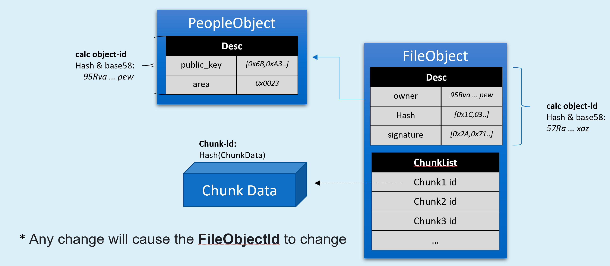

# 发布文件到OOD
现在我们拥有了自己的OOD，也拥有了自己的密码学身份，已经做好了全部准备工作，只需将文件上传到OOD就可以构造一个有效的CYFS Object URL了。

这一步需要使用之前用到的cyfs-tool来完成:
```
执行命令`npm i -g cyfs-tool`，安装beta版本的cyfs-tool工具
```

## 通过cyfs-runtime上传文件
现在你在开发机上已经拥有了已经激活的cyfs-runtime(本机上安装了CYFS浏览器([下载页](../Download.md))，并且已经激活过都可以达到该状态),可以通过cyfs-runtime将本机的文件上传到自己的OOD上。
```
使用命令`cyfs upload <file_path>`, 将本地<file_path>指向的文件，上传到OOD上。
```
这个命令还有两个可选参数，在大部分情况下，两个参数都可以省略。这两个参数如下：
- -e <runtime|ood>，指定cyfs tool使用本机的哪个协议栈，默认为`runtime`
- -t <runtime|ood>, 指定要将文件上传到哪个协议栈，默认为`ood`
  
稍待片刻，文件上传成功。此时工具会返回一个以`cyfs://o`开头的链接，这就是我想要的！    
这个链接我们又称作NamedObject Link，它是全网唯一的，将指向你刚刚上传的那个文件。

## 直接添加在OOD上已经存在的文件
如果要上传的文件很大，并且已经保存在OOD上了，我们也可以选择直接在OOD上添加文件到CYFS网络。

通过SSH登录OOD，OOD上也安装了cyfs-tool。然后使用命令`cyfs upload <file_path> -e ood`, 将本地<file_path>指向的文件，添加到OOD。
- -e ood，这个选项表示cyfs tool将使用本机的OOD协议栈，此时该选项不可省略

在OOD上执行这个命令，你可以观察到由于少了上传的步骤，命令执行的速度会快很多。命令执行完毕后，也会生成以`cyfs://o`开头的链接。

**注意**： 这个命令在OOD上执行时是"*标记*"而不是"*上传*"，如果你删除了OOD上的本地文件，这个链接就会失效。在cyfs-runtime所在机器上执行时是"*上传*"，上传完成后可以删除runtime机器上的本地文件。通过cyfs upload命令上传的文件，默认会保存在OOD的/cyfs/data/ 目录下。

# 下载文件
文件上传成功后，生成的对象链接就可以让别人访问。可以在CYFS浏览器中直接打开查看，也可以通过`cyfs-tool`来下载。

使用命令`cyfs get {cyfs://} -s <save_path>`，可以将文件通过cyfs-runtime协议栈下载到本地
- 如果想使用OOD协议栈下载，要在OOD上执行该命令，并且加上-e ood参数。

存储逻辑：
- 如果save_path是一个不存在的文件路径，则：
  - 如果cyfs链接指向一个目录，则目录中的所有内容会被下载到save_path目录
  - 如果cyfs链接指向一个文件，或一个目录中的子文件，该文件会被下载到save_path文件
  - 如果cyfs链接指向的是一个子目录, 子目录里的内容会被下载到save_path目录下
- 如果save_path是一个已存在的目录，则：
  - 如果cyfs链接指向一个目录，则目录的所有内容会被下载到save_path/{objectid}目录
  - 如果cyfs链接指向一个文件，则文件会被下载到save_path/{fileid.file}文件
  - 如果cyfs链接指向的是一个子目录，或子文件，指向的内容会被下载到save_path/{子目录名或子文件名}

当在runtime上下载时，由于是点对点的传输，这个runtime对应的OOD上是不会缓存这个数据的。

# GET原理介绍
我们对刚刚完成的工作的原理再做一点扩展阅读，可以更多的了解一些CYFS的重要基础概念。

## NamedObject和NamedData
文件是典型的非结构化数据，但在CYFS里，我们通过一个结构化的NamedObject来表示，这个对象被称作FileObject，是CYFS的标准对象之一。 
从本地文件创建得到的ObjectId为 57Ra...xaz 的FileObject的结构如下图：


如上图所示，FileObject是NamedObject，其Desc部分包含了文件的Hash，因此文件的任何改动都会导致FileObject的ObjectId改变。同时FileObject里有ChunkList字段，用ChunkId是分块数据的Hash，指向了分块的文件内容。ChunkList并不进入FileObject的Desc计算，因此我们为FileObject的构造者保留了如何更好的对原始文件进行切片的自由。

这些切片的，用带长度的Hash标识的非结构化数据，我们称作ChunkData，又叫NamedData。   

CYFS中，处理NamedObject的传输/保存的协议和组件被称作NON(NamedObjectNetwork),处理NamedData的传输/保存的协议和组件被称作NDN(NamedDataNetwork)。如果您有一些网络协议的开发经验，可能听过NDN这个术语。没错，NDN这个术语不是我们发明的，这是一个有一定历史的理论，我们继承了学界对NDN的大量研究成果，并进行了一些改进。cyfs://很大概率是第一个基于NDN理论的商用应用协议实现。对NDN理论进行解释很明显超过了本文的边界，如果您有兴趣，可以对NDN相关理论进行深入了解，可以更好的理解CYFS的架构设计。

## 下载流程
我们把下载方称作runtime,下载方自己的OOD称作OOD，把资源方称作OOD,先做整体流程分析：
1. runtime通过CYFS Object URL，基于NON得到FileObject。
2. runtime通过FileObject中的ChunkList，挨个基于ChunkId在NDN网络中得到ChunkData。

从上面的流程可以看到，NON主要解决NamedObject的获取，NDN主要解决NamedData的获取，这两块的实现CYFS使用了完全不同的协议。NON协议相对来说更重视降低延迟，而NDN协议基于NDN理论，原生支持多源传输，更重视最大带宽利用和网络整体的负载均衡。

下面是一个典型的完整流程：
- runtime在本地缓存中查看对象是否存在
- runtime发起NamedObject查询需求(下列行为不是串行的)
  - 向OOD查询NamedObject是否存在
  - OOD查询MetaChain，NamedObject是否存在
  - OOD根据get中的Reference信息，在上一跳设备上查询NamedObject是否存在
- OOD通过MetaChain查询Object's Owner Zone的配置
- OOD通过Zone配置，连接NamedObject's OOD，或则连接NamedObject’ Cache,查询NamedObject

得到ChunkId后，runtime调用BDT的Channel接口(NDN语义接口)请求Chunk
- 对于首个，小的Chunk，直接从关联OOD上获取
- 对于第二个Chunk，会尝试从上一跳(Reference OOD)获取
- BDT会尝试基于应用层的Context信息，进行多源查找和基于喷泉码的多源下载
- 路由器能识别BDT发出的Chunk请求包，进行拦截、转发，进一步优化网络的整体负载

# 小结
恭喜！到这里你已经完成了CYFS第一个阶段的学习！虽然内容非常简单，但你已经通过CYFS Object URL，实践了Web3给人们带来的一项重要基础权利:“每个人都拥有在互联网上保存内容和发布内容的权利”。只要CYFS Object URL的Owner愿意，这个Link就永远可以被打开，而从使用者的角度来看，这是一个指向不会被篡改内容的可信URL。


