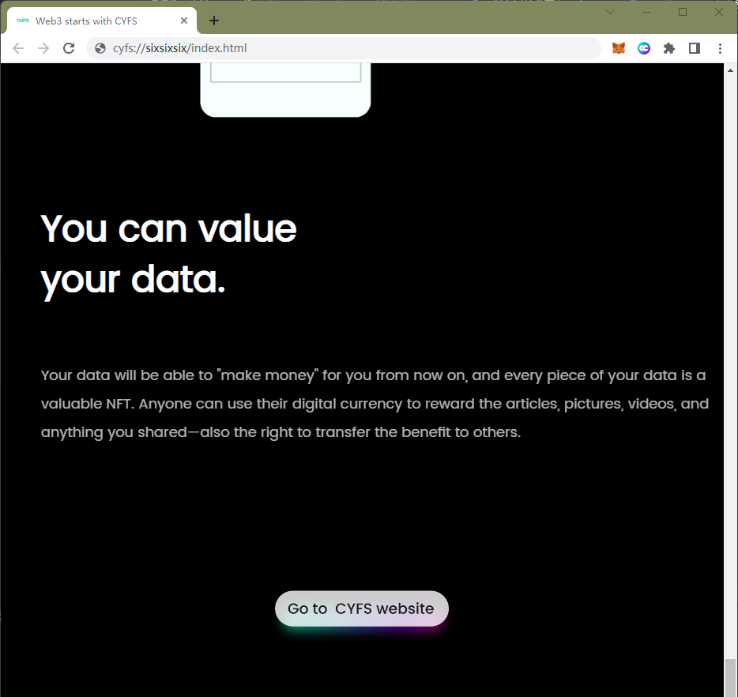

# 发布静态网站

有了上述功能我们能进一步构建一个传统的Web网站么？我们当然可以一个文件一个文件的上传，但这会非常麻烦。。。
为了解决这个问题，CYFS提供了和FileObject对等的另一种基础的Named Object: DirObject,可以把一个目录整体的上传。其构建方法如下：

## 使用upload命令发布静态网站
准备一个静态网站,保存在本地目录www中， 我们把www目录下的所有文件都发布到ood上并构造DirObject 使用命令`cyfs upload www`
```powershell
PS E:\> cyfs upload www
[info],[2022-06-14 23:19:23.831],<>,cyfs-sdk version 1.0-nightly (2022-06-13), index.js:49298
[info],[2022-06-14 23:19:24.496],<>,[cyfs], 工具目录： C:\Users\Bucky\AppData\Roaming\npm\node_modules\cyfs-tool-nightly, cyfs.js:2538
...
[info],[2022-06-14 23:19:54.137],<>,will get trans task state:  http://127.0.0.1:1322/trans/task/state [object Object], index.js:71829
```

命令执行完成，本地的www目录已经被上传到OOD并产生了 Web3.0的唯一连接。
可用CYFS浏览器打开cyfs://o/5r4MYfFDmENKMkjtaZztmnpSNTDSoRd6kCWuLSo4ftMS/95RvaS5azgt176LqHAEMEmkr9ieW2DTL7yosXv2fUES8/{目录内部路径} 可访问对应文件

## 用cyfs浏览器打开这个静态网站
用上一步的url的地址, 加上之前的www下放置有`index.html` 网站入口文件, 最终URL的如`cyfs://o/5r4MYfFDmENKMkjtaZztmnpSNTDSoRd6kCWuLSo4ftMS/95RvaS5azgt176LqHAEMEmkr9ieW2DTL7yosXv2fUES8/index.html` 复制粘贴到CYFS浏览器地址栏, 效果如下:


*** 注意在地址栏中输入cyfs://o/5r4MYfFDmENKMkjtaZztmnpSNTDSoRd6kCWuLSo4ftMS/95RvaS5azgt176LqHAEMEmkr9ieW2DTL7yosXv2fUES8/ 并不会自动的补齐index.html。这有时会带来一些不便，在CYFS后续的版本里我们会尝试解决这个问题。

在index.html中，我们可以使用类似``这样的标签，通过相对路径引用文件夹内的资源。CYFS浏览器会自动将这个地址补齐为cyfs://o/5r4MYfFDmENKMkjtaZztmnpSNTDSoRd6kCWuLSo4ftMS/95RvaS5azgt176LqHAEMEmkr9ieW2DTL7yosXv2fUES8/image/img.png，从而正确地加载资源。

**注意**: 无法使用绝对路径，类似``来加载资源。这是由于cyfs链接增加了一些其他的信息，与传统的URI标准并不一样

# CYFS 语义链接
通过前面的学习，我们已经充分了解了CYFS Object URL是指向不可变的可信内容的。这些URL里包含密码学的信息，绝对不适合在浏览器地址栏中输入。有的时候，我们还是需要指向最新内容的URL（比如某人的头像），或则有一些URL我们希望用户能手工在浏览器中输入。CYFS提供了语义URL来解决这个需求。
```
cyfs://$name/$path
```
上述设计与HTTP URL类似，但有几点核心不同
1. CYFS基于MetaChain实现的名字系统是去中心的，您可以真正的拥有一个名字。HTTP协议使用的DNS系统本质上是中心化的，任何人持有的域名原理上都可能被管理机构（注册局）剥夺。因此cyfs的名字是没有后缀的。
2. CYFS使用智能合约实现了名字的常见交易场景
3. CYFS上一个名字只能配置到一个具体的NamedObjectId，这个设计让CYFS语义URL指向的内容是可信可变的。

举个例子，当在CYFS浏览器中输入cyfs://cyfs/index时，会按下面逻辑解析
1. 读取MetaChain，得到cyfs名字的状态
2. 这是一个有效的名字，并指向了一个DirObject,Id是95RvaS5azgt176LqHAEMEmkr9ieW2DTL7yosXv2fUES8,Owner是5r4MYfFDmENKMkjtaZztmnpSNTDSoRd6kCWuLSo4ftMS 
3. CYFS浏览器根据上述信息，讲语义链接cyfs://cyfs/index成功转换为cyfs://o/5r4MYfFDmENKMkjtaZztmnpSNTDSoRd6kCWuLSo4ftMS/95RvaS5azgt176LqHAEMEmkr9ieW2DTL7yosXv2fUES8/index，并按Object Link的打开方式继续处理。

## Tips
- CYFS 协议约定了Name配置成不同类型的Object时的URL转换规范     
- subname.name 这类子名字的支持方式还未最终确定   
- 在CYFS Beta网获得的名字仅作测试，并不一定能直接带到正式网。CYFS正式网会从生态健康的角度考虑，更好的支持传统域名的拥有者迁移到CYFS 名字系统。


# 实战Name的购买和配置


说明一下DMC，购买名字的一些基本商业逻辑
## 购买名字
使用meta的bidname命令，尝试在链上购买一个名字
```
cyfs meta bidname <name> -c <caller_file> -o [name_owner] [bid_price] [rent_price]
```
name_owner不指定的话，默认为caller的id

bid_price和rent_price的单位都是Qiu，1 Qiu = 10^-6 DMC

示例，购买一个名字sixsixsix
```
cyfs meta bidname sixsixsix -c  C:\Users\Bucky\.cyfs_profile\People 500000 500000
```

命令执行后，会返回一个TxId。可以使用receipt命令查看交易结果。

```
cyfs meta getreceipt 8YCfQUGm7Aiz2dM3BFKdU1q8fbX6moo4GG6LGzYA8Row
```

如果这个名字已经被人买了，自然会购买失败，可以将sixsixsix换成自己想到的一个独一无二的名字

## 等待购买完毕
因为CYFS的名字购买是基于拍卖逻辑的，当bidname成功后，要等一段时间，这个名字才会真正属于你，并可以绑定。

可以用`cyfs meta getname <name>`来查看名字的购买状态，当state变为0时，表示购买完毕，可以继续绑定名字了

## 绑定名字
名字购买成功后，默认绑定为caller的id。这里我们要使用namelink命令，将name绑定到DirObject的Id，这样就可以通过cyfs://{name|/index.html来打开刚刚的网页了
```
cyfs meta namelink <name> -c <caller> -t <type> <objid>
```
- name: 要绑定的名字
- caller：名字购买者的身份文件
- type：我们想要将名字绑定到一个id，这里填"obj"
- objid：要绑定到的objid
例子：将sixsixsix绑定到Id 95RvaS5azgt176LqHAEMEmkr9ieW2DTL7yosXv2fUES8
```
cyfs meta namelink sixsixsix -c C:\Users\Bucky\.cyfs_profile\People -t obj 95RvaS5azgt176LqHAEMEmkr9ieW2DTL7yosXv2fUES8 
```

## 确认名字绑定成功
等待一段时间让交易上链，然后可以查看名字的绑定情况，确认名字绑定成功
```
cyfs meta getname sixsixsix
```

## 在浏览器里打开语义链接
访问 `cyfs://sixsixsix/index.html`，效果如下:




# 结语
在名字概念的帮助下，我们通过语义链接实现了动态的cyfs://，但与HTTP协议不同的是，所有有效的记录一定是域名拥有者产生的，其修改记录是可以完全基于区块查询的。这种先通过一个路径得到ObjectId，在用Object Link得到可信对象的思路简单直白，却有深刻的内涵。稍作展开，就是比智能合约更好的，实现可信计算的基础设施。到这里《Hello,CYFS》的内容就全部结束了，你已经了解了CYFS里最重要的基础概念，并已经从技术的角度体会了Web3的Ownership是如何实现的，体会了Web3是如何“保障每个人都拥有保存内容和发布内容，并通过内容直接获得收入的权利”，这将是Internet本身的一次重大进步。但这只是CYFS里的一小部分知识，在下一个阶段，您将继续学习如何使用CYFS来构建真正的去中心服务:DEC App,并深刻理解数据产权与共识。
